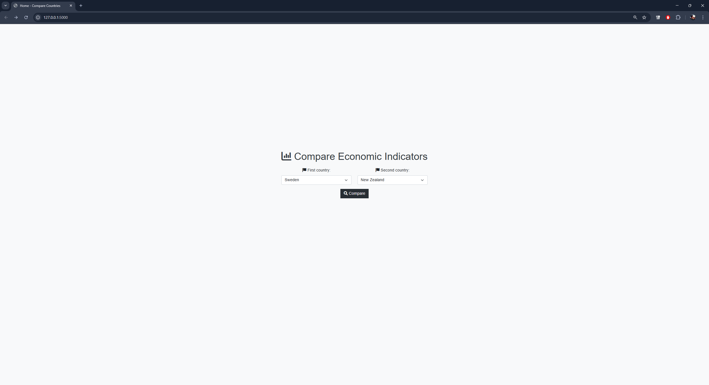
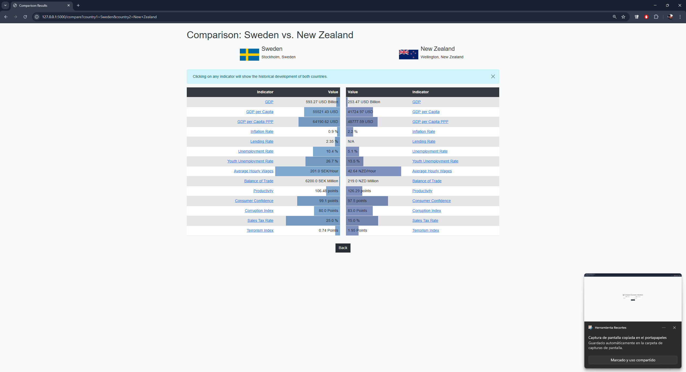
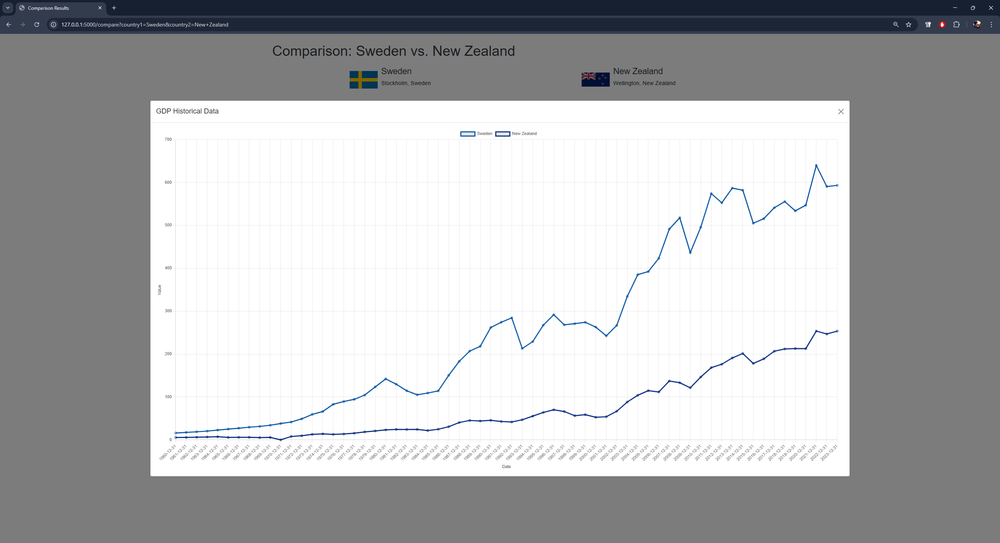

# Economic Indicators Comparison &nbsp; 

A Flask-based web application that lets users compare key economic indicators across countries using the Trading Economics API.

---

## ✨ Features

- **Compare Countries**: Choose two different countries to compare.
- **Trading Economics API**: Fetch real-time and historical economic indicators.
- **Interactive Charts**: View historical data in a modal chart (powered by Chart.js).
- **Bootstrap UI**: A clean, responsive interface.

---

## 🔧 Prerequisites

- **Python 3.10+** (other Python 3.x versions may work, but 3.10 is recommended)
- A valid [Trading Economics API key](https://tradingeconomics.com/api/)

---

## 📥 Installation

### 1. Clone the Repository
```bash
git clone https://github.com/antoniol00/tradingeconomics
cd tradingeconomics/country_comparator
```
### 2. Create & Activate a Virtual Environment
```bash
python3 -m venv venv
source venv/bin/activate
# On Windows use:
venv\Scripts\activate
```
### 3. Install Dependencies
```bash
pip install -r requirements.txt
```
### 4. Configure Your Trading Economics API Key
Open config.py and replace the placeholder with your valid key:
```bash
TRADING_ECONOMICS_API_KEY = 'YOUR_TE_API_KEY'
# You can also store your key in an environment variable and load it dynamically.
```
---

## 🚀 Running the App

Once everything is configured:
```bash
flask run
```
By default, this will host the site at: http://127.0.0.1:5000

---

## 🌐 Usage

- Access the Home Page: Go to http://127.0.0.1:5000/.
- Select Two Countries: Use the dropdowns to pick two different countries.

- Compare: View each country’s most recent economic indicators side by side.

- Historical View: Click any indicator row to display a modal chart of both countries’ historical data.

  
---

## 📂 Project Structure
```bash
economic-indicators-comparison/
├── app.py            # Main Flask entry point
├── config.py         # Configuration, including your Trading Economics API key
├── utils.py          # Helper functions to fetch indicators & historical data
├── templates/
│   ├── base.html     # Base HTML template
│   ├── index.html    # Landing page template
│   ├── compare.html  # Results & comparison page
├── requirements.txt  # Python dependencies
└── README.md         # This README
```

---

## ❓ Troubleshooting

- Connection Refused/Proxy Errors: Ensure your server or hosting environment allows outbound HTTPS on port 443 to api.tradingeconomics.com.
- Missing or Invalid Data: Check that your Trading Economics API key is correct. It should be working without one but it is recommended to set it up.